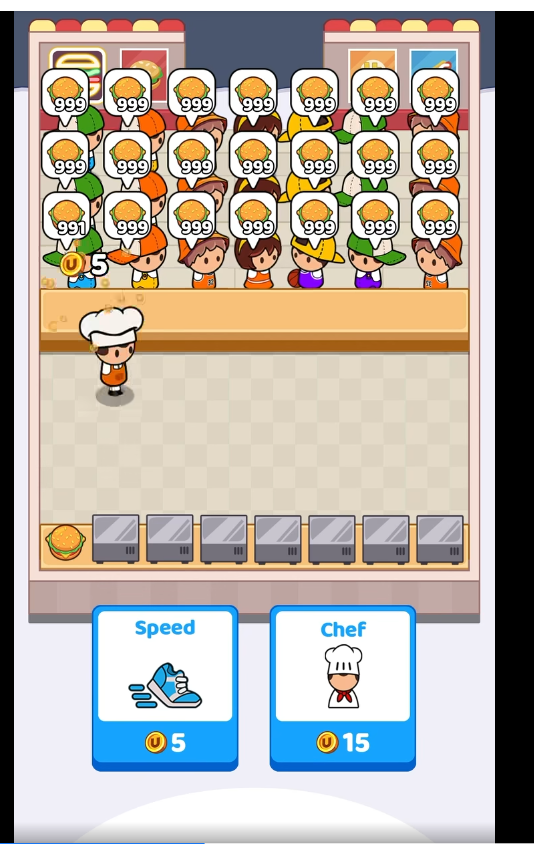

# Visual reference and art direction

## Source of truth

The supplied 30-second Food Fever video is the primary audiovisual reference for this milestone, with the user's detailed prompt specifying dynamics not visible in sampled frames. The user's attached gameplay screenshot, stored at [../Assets/Art/Reference/gameplay-layout-reference.png](../Assets/Art/Reference/gameplay-layout-reference.png), is the retained scene composition/style reference. Consult it before designing or changing any screen, character, object, sprite, or animation. Use it for its casual 2D cartoon language and readable vertical layout only; never reproduce its exact characters, illustrations, interface artwork, or assets.

## Audiovisual evidence and composition

The supplied MP4 is VP9, 1080×1920, 60 fps and 29.9667 seconds. The parent decoded all 1,798 samples: unique frame indices 0–1797 with none missing and 1,785 distinct frame hashes. The first browser seek/canvas capture incorrectly repeated the initial frame; it was a capture defect, not a static video. Visual review used a contact sheet at one-second intervals 0–29 plus full frames at 8 and 20 seconds; decoding every frame is not a claim that each was visually inspected separately.

| Time | Verified visual observation |
|---|---|
| 0–3.5 s | White price panel, blue header, Burger Price slider and green Start. Displayed prices include $0 initially, $52 around 1 s, $35 around 2 s and $5 around 3 s; these do not establish the slider's maximum. |
| ~3.60–3.817 s | Price panel closes with an animated transition. |
| 4–7 s | Customers enter and group: roughly twelve moving customers at 5 s, seven front-row 999 orders at 6 s, then 21 visible orders in seven columns/three rows at 7 s. |
| ~4–8 s | One chef starts on the right, walks down-left toward the product station (~6.6 s), then toward the left counter (~7.5 s). At 8 s the first order reads 998 with a $5 coin indicator; Speed is available, Cook still unavailable. |
| 10–29 s | First counter reads 996 at 10 s, 987 at 20 s and 978 at 29 s. Both upgrade buttons are available by 10 s; prices remain $5/$15. Chef walking/carrying is visible, including burger carrying during later frames. |

Only one chef appears; no purchase, finished customer departure, mixed-product order or level transition was demonstrated. Do not infer a complete physical round trip for every decrement from the roughly once-per-second counter changes: the user explicitly requests handoff-gated decrements/revenue, coordinated extra workers, the seven products and progression as extensions. Prices/demand correlation is requested, not experimentally established by this clip.

Normalize the observed 1080×1920 composition to a 540×960 logical safe-area canvas: signs occupy left/right top bands; customer feet approximately y310/240/170 in three rows; horizontal counter top y314/bottom y384; handoff worker feet around y400; worker floor y400–585; station pickup y578 with worker feet capped near y585; large management controls y675–855. The video shows signs at normalized y.01–.14, bubbles/crowd y.066–.325, counter y.325–.40, worker floor y.40–.60, stations y.59–.65 and stage foot near y.715. Speed spans x.16–.47 and Cook x.53–.84, y.695–.89. Preserve this functional hierarchy and scale without copying illustrations. Camera is fixed, frontal and slightly elevated, showing ground/object tops: not pure top-down, isometric or 3D. On tall portrait displays, extend the visible street vertically through the safe area while preserving one uniform scale for sprites and matching touch coordinates; do not leave solid letterbox bands or crop interaction controls.

## Required direction

- 100% 2D mobile cartoon: small expressive supporters with oversized heads, rounded shapes, vivid colors, clean dark contours, consistent proportions and fluid simple animation.
- On startup, hold the fully visible supplied Floresta cover for at least 4 seconds, then reveal the separate Hay Chori y Paty logo with a brief warm light flash and hold it fully visible for at least 4 more seconds. Only then show glossy blue Jugar/Salir buttons with white dark-outlined comic lettering, inspired by the supplied blue NEXT reference (original geometry, not copied pixels). Keep the cover/logo/menu until a choice; Jugar starts gameplay directly, Salir exits.
- Fixed portrait camera. No overhead stall signs/roof or upper stadium above the mural; crop the artwork at the mural wall and leave a broad unobstructed customer street behind a counter-only stall. Keep dense standing supporters with product/quantity/patience indicators above a horizontal separating counter, moving workers in the open lower playfield, product stations below and large hire/upgrade controls at bottom; retain automatic side condiments.
- Floresta public sidewalk, across from All Boys: the recognizable real mural on the wall across the street, ending at the top image boundary; no upper stadium facade, sky or floodlights. Latest user explicitly requests a much closer cartoon adaptation of the supplied real mural/corner photos: retain recognizable painted composition, footballer rows, windows, neighborhood buildings, justice portraits/inscription and corner AB oval/shield/memorial motifs. Render those as hand-drawn game art, not pasted photo texture; exclude photo watermarks, @handles and advertising. Do not imply indoor stadium service; other gameplay-art references are still style-only.
- In level 1, supporters rotate through nine original black/white/gray/cream All Boys-inspired outfits as complete, integrated body sprites: separate 3×3 atlases provide front-facing cheer and matching side-walk poses, and a 6×3 paired-pose timeout atlas preserves those same nine outfits during both angry riot poses. In level 2, use eight original green/black/off-white Nueva Chicago supporter outfits integrated into their full-body front, matching profile-walk and paired angry/stick-swing timeout sprites. The same customer ID must select the same outfit in the regular crowd and the trifulca. Apply this rule to every future team: team-specific riot sprites keep each fan’s normal integrated outfit; never use a separate mismatched riot wardrobe or layer garment PNGs over bodies. Blue, pink and brightly colored goalkeeper candidates stay out of the crowd. Preserve distinct identities and animation. These are original cartoon interpretations, not exact retail-kit reproductions.
- Grill must read as an Argentine iron street parrilla with embers, chorizo and bread, not an industrial kitchen. Condiments are an automatic stop; there is no seating.

## Do not

Use photorealism, 3D characters, generic indoor-restaurant styling, seated diners, unapproved menu items, or literal copies of the reference's protected visual assets.

## Retained legacy assets and new milestone

Historical prototype assets: `Assets/Art/Placeholder/Resources/floresta-background-v2.png` is an empty original cartoon Floresta sidewalk/stadium-perimeter backdrop; `floresta-atlas-v2.png` supplies distinct black-and-white supporters, Argentine iron parrilla/embers/chorizos, cooler, condiment table, chori/Coca icons and a red-apron vendor. The atlas has seven vendor poses: idle, two walk, two cook and two serve frames. Simple 7 fps frame animation and view-only movement respond to actual round work/deliveries; hired sellers have separate working positions. Live customers, order icons and patience bars replace the old baked crowd, with up to twelve visible orders in two rows.

The atlas generator did not produce an exact geometric grid: PrototypeView uses reviewed individual pixel bounds at authored 1402×1122, not equal cells or imported texture dimensions. Import with NPOT resize/mipmaps off, alpha transparency and uncompressed max2048. Keep all art **provisional and swappable**, not a final-art or device-performance claim. Earlier plate/seller/atlas files and their metas are preserved but no longer consumed by the active view.

Editor screenshots reviewed at 540×960 (9:16), with player reference settings 1080×1920. For the historical0.1.0 prototype, Android safe-area fitting and native touch buttons were reviewed on the API36 emulator at1080×2400 (see features/android-prototype.md); physical hardware/other cutouts, sound, animation polish and final balancing remain later checks. Use async MCP screenshots (`include_image=false`) and inspect the resulting file: the v10 inline capture path can fall back to camera-only imagery (omitting IMGUI) and leave Play paused.

The new milestone requires original commercial-style backdrop, characters, all seven catalog products/stations, order/UI/coin effects and directional movement/carry/pickup/handoff states. Generated files and cropped bounds must be documented only after they actually exist and are reviewed/imported. No final-art, animation or performance completion claim follows from a generation request. Keep art swappable and preserve existing files/metas. See [street automation acceptance](features/street-automation.md).

Historical generation prompts/method: see `Assets/Art/Placeholder/GenerationPrompts.md`.

### Full-sequence count measurement

All 1798 frames were decoded without missing indices; source is 60 fps / 29.9667s (not exactly 1800 encoded frames). After crowd settlement, a binary digit-template comparison checked every frame in the first customer counter, using visually verified templates and five stable frames per change. The displayed order decreases from999 to977 by the last frame:22 unit decrements, approximately1.02s between changes. Approximate animation-onset events:7.95s→998,8.95→997,9.983→996,11.017→995,20.217→986,28.383→978,29.383→977. These are image measurements, not access to Food Fever internal logic. The worker visibly carries a burger away from the counter later while the count keeps changing; do not invent a new full station roundtrip for each observed decrement. The requested game must nevertheless gate each unit/revenue by its real handoff.

Private analysis evidence (ignored, not gameplay art or GitHub content): `Logs/ReferenceAnalysis/{status.json,metrics.jsonl,index.json,quantity-analysis.json,contact-00.png,contact-10.png,contact-20.png,transitions.png}`. Decoder used installed browser WebCodecs VP9 and a temporary loopback server; no packages installed or video sent externally.

## Historical Street art — imported and reviewed before the open-street update

Historical `Assets/Art/Street/Resources/street-background-v2.png` (940×1672) places the All Boys perimeter, original stall signage, counter and Argentine sidewalk in the measured functional bands. `street-characters.png` (1254×1254 RGBA) contains16 original worker/fan poses; `street-items.png` (1402×1122 RGBA) contains the seven products, parrilla/cooler/condiments and management/coin/order sprites. StreetView uses individually reviewed16/20 pixel rectangles, not assumed grid cells. NPOT resizing/mipmaps off; uncompressed max2048 and Android RGBA32 overrides.

Actual reviewed Game-view evidence: ignored `Logs/Acceptance/street-layout-final.png`. Generated method/prompts: `Assets/Art/Street/GenerationPrompts.md`. Directional frame walking and state-driven pickup/carry/handoff, moving/receiving fans and sale effects are active, but additional frame polish/audio and distinct four later-club illustrations remain pending. Original background v1 and all existing metas are retained.

## Historical first Floresta opposite-wall mural interpretation — 2026-10-04

User-supplied All Boys mural photo is a location/composition reference, not a source to trace. The historical versioned `Assets/Art/Street/Resources/street-background-mural-v3.png` replaces only the previously blank far stadium wall with original monochrome cartoon supporter art, retaining the composed stall, road/sidewalk, foreground play area, controls-safe area, and all other scene elements. Existing `street-background-v2.png` and its `.meta` remain untouched. New import settings match the old background (NPOT resize/mips off; Android texture override retained). See `Assets/Art/Street/GenerationPrompts.md`. Imported and reviewed in Main's Play-mode Game View at the start menu; screenshot: ignored `Logs/Acceptance/Mural/floresta-mural-menu.png`.

## Parrillero appearance — 2026-10-03

User photo is appearance reference, not graphic style: very overweight adult, dark wavy hair/light stubble, fuller cheeks and double chin, matched face/body skin hue, bare shoulders/arms/back (no shirt), dirty white bib apron with grease/charcoal stains. Visible role is **Parrillero**, not Cocinero. Original cartoon likeness, no copied photo/logo/tattoo. Preserve existing fans, 2D composition and seven products.

New transparent16-pose atlas and hire portrait: Assets/Art/Street/Resources/street-parrillero{,-icon}.png. Reviewed independent bounds in Assets/Art/Street/parrillero-poses.json; exact built-in prompts in ParrilleroGenerationPrompts.md. Real MCP import16namedSprite, original dimensions/alpha/AndroidRGBA32 and foot pivots verified;3/3art and1/1affected pointer checks passed. Actual editor Game-view capture reviewed in Logs/Acceptance/Parrillero/parrillero-final.png: profile walk and matching portrait/Parrillero label. Native visual check pending; no device-performance claim.

Diagonal walking extends this same identity through a separately versioned transparent4×2atlas: four quarter-view directions, each with opposing leg phases, while the original sixteen-pose sheet and its GUID stay unchanged. Bounds/import settings and gait selection are tracked in the [street-automation feature spec](features/street-automation.md); in-engine visual confirmation remains pending.

Face references: user supplied four photos and explicitly selected the drawn adult-face variant; retain its eyes/nose/toothy smile while making cheeks/jaw fuller and matching face/neck skin palette to body. Do not revert to giant-eyed alternate or photographic head. Selected sheet1315x1197 and portrait1315x1196; previous character files and GUIDs retained.

## Large street parrilla — 2026-10-04

User supplied two real crowded sidewalk-grill photographs as ambience/object-scale references, not graphic style or copied assets. Replace tiny individual BBQ presentation with one original long black-iron parrilla, dense rows of visible chorizos, charcoal/embers and pan francés rolls (not hamburger buns). Do not show a duplicate floating choripán badge over the grate. Preserve casual2D cartoon, frontal slightly elevated view, existing supporters/Parrillero/UI/safe-area and seven-product limit. In Floresta the parrilla spans nearly the full station row; when drinks unlock, keep one shared hot-food grill plus the original separate drink stations. The grill-only change initially kept pickup anchors/automatic handoff, recipes, coins and pacing unchanged; the later serving-table requirement below reroutes only choripán pickup.

- [x] Original transparent large-grill sprite imported with consistent style/alpha.
- [x] Actual Game-view grill visibly proportionate, no HUD/button/path obstruction; affected art/input and pending first-level rules verified.
- [x] New APK built/verified only; explicitly no phone connection/install/launch this turn.

Integrated original2172x724RGBA Resources/street-parrilla-large.png with NPOT/mipmaps off, uncompressed4096/AndroidRGBA32. Real9art checks passed in41-case targetedEditMode job;11pointer checks passed. Actual1080x1920Game-view captures reviewed for Ready/FlorestaPlaying/seven-products: loaded full-width grill, clear HUD/buttons and drink stations, unchanged worker anchors; exact editor progress restored after stoppingPlay. Evidence ignored under Logs/Acceptance/LargeGrill/. Exact prompt retained in Assets/Art/Street/GenerationPrompts.md.

Current pan-francés art is the versioned `street-parrilla-large-v2.png` (same2172x724 canvas and Android importer settings); the original asset/GUID remains preserved. The four round buns were replaced by four long French rolls, and the first-product floating badge above the grill was removed. Later product badges/name labels remain only where they do not overlap the serving table added below.

APK0.2.3/code5 succeeded363.11s,0errors/3warnings; signature/package/ABI verified. Not installed or run natively by explicit user request; physical visual/FPS validation remains pending.

## Parrillero serving table — 2026-10-04

Place an original worn wooden trestle/caballetes table beside the foreground edge of the parrilla. The tabletop is laden with ready-to-serve Argentine choripanes in pan francés, not loose sausages or hamburgers; add restrained scuffs, grease marks and crumbs to make the work surface look used. Keep the game's warm, strongly outlined 2D cartoon treatment and transparent sprite background. In the current 540-wide layout it sits low on the left, visually adjoining/overlapping only the near edge of the grill; do not cover the drink stations or the lower upgrade buttons. The Parrillero's chori pickup point is at the table's right edge so he visibly steps over to fetch sandwiches; the existing other product-station positions remain unchanged. Do not change the grill recipe, delivered-unit accounting, queue, or prices.

The original sprite, prompt, SHA-256 and fresh Unity importer metadata are recorded in `Assets/Art/Street/GenerationPrompts.md` and `Assets/Art/Street/Resources/street-serving-table-v1.png.meta`.

- [x] Resource is drawn beside the grill and product-zero worker path targets the serving table.
- [ ] Unity import/Game-view composition, small-screen readability and path clearance reviewed.

**Validation:** No Unity or test execution; the user asked not to test until requested. No APK.

## Selected startup artwork — 2026-10-04

The user selected the supplied portrait cover and transparent title logo, retained unchanged as `Assets/Art/Street/Resources/street-cover.png` and `street-logo.png` with new preserved metas. Follow the explicit requested cover→logo/light-flash sequence; the latest WhatsApp clip itself was not visually inspected, so do not claim frame-matched reproduction. The original reference direction still governs gameplay art.

Real 1080×1920 Game-view captures reviewed: ignored `Logs/Acceptance/Intro/{cover,logo-flash,ready}.png`. The separate representative `wardrobe-floresta.png` records the previous 15-look rotation; the user later rejected its bright supporter colors. The current nine-look monochrome selection has not had a new Game-view review or test. Native/device appearance remains unverified until requested installation.

### Blue startup menu — source update, validation deferred (2026-10-04)

StreetView authors the cyan→blue capsule/edge/gloss/shadow as one runtime texture, released on disable; cover/logo remain unchanged. Menu uses bundled Luckiest Guy Regular (Astigmatic/Brian J. Bonislawsky), white uppercase JUGAR/SALIR and an eight-direction dark outline. Official source: https://github.com/google/fonts/tree/main/apache/luckiestguy; Apache 2.0 license retained beside Resources/Menu/LuckiestGuy-Regular.ttf. New flow/visuals have not been tested or reviewed in Play/device; no new APK by explicit user instruction.

### Floresta price-popup removal — source update (2026-10-04)

Level 1 must never show a price popup, including the old read-only $5 card. Ready keeps only a blue JUGAR action and unlocked-level navigation over the existing scene; startup Jugar still starts directly. Later-level price panels remain unchanged. Visual/runtime checks deferred by user.

### Visible FIFO advance — source update (2026-10-04)

When a supporter departs, existing supporters directly behind advance along their same column before a new arrival takes the last place. Reuse original walking poses; preserve clothing/customer identity and visible order/patience bubbles while advancing. Draw depth uses actual feet positions during movement rather than future row targets. Never animate a newcomer jumping ahead or a rear customer receiving service past the front. No new art/layout; Play/device visual review deferred.

## Open crowd street and counter-only stall — 2026-10-04

Current source selects `Assets/Art/Street/Resources/street-background-open-street-v4.png` (940×1673, opaque). Built-in ImageGen edited the existing original v3 backdrop: mural reaches the top edge with no upper stadium/sky/floodlights; roof, HAY CHORI Y PATY header, hanging chalkboards and tall support poles removed. The expanded empty street behind the counter now spans roughly image y180–548 for the three customer rows; counter top/front retain approximately y548–655, equivalent to logical y314–376. Foreground worker sidewalk, right automatic-condiment bench and lower blank HUD band remain in their established bands.

StreetView removes the two obsolete upper sign-product overlays; individual order/product bubbles remain. No customer/worker/station/GUI input anchors changed. Previous backdrop files/GUIDs retained. New meta inherits NPOT/mips off, max2048 and AndroidRGBA32 from v3, with fresh asset/Sprite GUIDs and full940×1673 bounds. Exact built-in prompt/provenance retained in `Assets/Art/Street/GenerationPrompts.md`.

New image visually reviewed as a static asset only, not a Game-view capture. No tests, Play, APK, device or Unity import/compilation confirmation by the standing user instruction.

## Waiting crowd motion — source update (2026-10-04)

Use the existing four original cheering fan identities, not a cycle through different people. Add small breathing/stretch, foot-pivot sway/weight shift and intermittent double bounces with customer-specific phases/rhythms. Keep amplitudes modest in the dense queue; transform the Floresta garment with the body and restore the view matrix before drawing fixed order/quantity/patience indicators. Existing walk/advance/receive/exit states remain distinct. Animation follows simulation time without changing customer anchors, FIFO or deliveries. No new raster art; actual Game/device readability and motion review deferred (no tests/Play/APK).

## Presentation logo as app icon — source update (2026-10-04)

User selected the existing transparent Hay Chori y Paty intro logo as application icon too. Keep its original pixels/lettering and intro unchanged. Unity default/Android legacy-round slots reuse the texture; adaptive Android branding uses a build-only native XML inset over a matching cream background, with no repainting or new raster art. Full-badge fit/readability in actual launcher masks remains pending; no tests/Play/APK or device update.

## Gold-only currency and historical top-corner HUD (superseded layout) — source update (2026-10-04)

Original transparent `Resources/street-coin-gold-v2.png` depicts choripán and paty/burger embossed on one coin. Latest user clarification requires100%gold tones only: food/ribbons are gold relief, without red/green/blue/white enamel or flag accents. Colored generation draft was not integrated. Preserve the2D cartoon silhouette, alpha and original assets/metas. Use it for the upper-left coin balance and actual delivery-income effect.

Upper-right shows choripán plus actual sales/1000in Floresta (100/1000example); later levels retain their actual goal/generic progress marker. Slim sprite-backed blue/cream32px panels fit logicaly4–36, above rear-row bubbles beginningy38; coin silhouette fitsy3–37. Existing safe-area transform, crowd/stall and button anchors stay; countdown remains lower. Static art/source review only: actual small-size readability/alignment/import not yet verified; no tests/Play/APK.

## Full-screen startup and consistent Parrillero — 2026-10-04

Latest user request supersedes preserving the original cover character: no top/bottom letterbox bands during presentation/menu. Full-screen decorative background center-crops proportionally to physical dimensions, while logo/hero/Jugar/Salir retain safe-area placement and input alignment. Reuse the exact game`street-parrillero-icon.png` portrait (not redraw/generate another face), with its wavy dark hair, distinctive broad nose/eyes/toothy grin, light stubble, very heavy bare arms, dirty white apron and grill tattoo. The original logo and4+4second timing remain; gameplay layout is untouched. Generate only a versioned background without the old foreground man, consistent cartoon street-stall/night-stadium ambience and food counter, no baked text/logo/UI. Previous cover/portrait/logo assets/metas preserved.

Implementation reviewed in actual1080×1920and1200×2670Game-view menus: full-screen scene behind the literal unchanged portrait, no old hero, original title/menu. Original selected assets/metas untouched;17art/13pointer checks passed. Screen captures remain ignored`Logs/Acceptance/IntroFullScreen`; no new mobile build by explicit project-only user choice.

## Unified upper status bar — source update (2026-10-04)

User's attached compact glossy cartoon HUD is style/layout inspiration only; do not copy its art. Current HUD uses an original amber/brown rounded continuous frame with recessed capsules: gold-only game coin/balance left, clock/countdown center, choripán and actual Delivered/Goal in green right (generic progress marker in later levels). Use bundled Luckiest Guy white numbers with dark outline, no wrapping, and fit each value to both its slot width and height. Time is simulation-derived remaining time rounded up as m:ss, clamped at zero; remove the old lower Tiempo label.

The decorative bar runs edge-to-edge across the physical screen width; its outer rim has no horizontal inset. On tall cutout phones, keep the centered camera channel clear, then use the entire lower blue clock capsule for the m:ss countdown (logical x202–326, y35–67) instead of a narrow right-hand text slot. Other live counters avoid the camera channel while the bar background remains continuous behind it. Give the right sales capsule extra room; the paired product icons identify Level-2 counters. Keep interactive anchors and the street layout unchanged. Runtime texture is generated once per enable and released on disable; no copied/reference artwork, new asset imports or packages. First-level goal remains200/120seconds.

- [x] Source renders all three live indicators in the new top bar and removes lower timer.
- [ ] Unity compilation and Game-view/device review confirm readability, alignment and no rear-order/cutout overlap.

**Validation:** Targeted static geometry/countdown/source review only; Unity readiness ping unanswered. Added focused HUD geometry, countdown and texture-lifecycle fixtures, not executed. No APK.

## Recognizable real mural and stadium-corner layer — 2026-10-04

Latest user asks a substantially closer cartoon interpretation of the supplied real street mural, adding optional corner imagery. Use the actual horizontal black/white painted-wall composition: rows of players/history figures, barred windows, grouped standing team, neighborhood architectural outlines, three justice portraits/outstretched figure and FLORESTA POR JUSTICIA. Add the blue/white AB oval with small pitch, C.A.ALL BOYS shield/circular monograms on a left wall return and secondary black/white sneaker memorial on right. No social watermarks, ad banner, phone number, upper building/sky/roof or baked gameplay objects.

New original Resources/street-mural-real-v5.png is940×1673RGB, preserved byte-for-byte with fresh inherited meta. ImageGen's full plate shifted lower scenery in both drafts, so StreetView consumes only its wall source rect(0,0,940,234), stretched into logical(0,0,540,106) over the retained v4 base. The overlay extends through the full original v4 mural band so that the old mural does not reappear as a second strip underneath. Everything belowy106 keeps exact original v4 road/counter/foreground/cream panel pixels and all existing live-character/HUD/input anchors. No raster cropping/resampling/export; this is a native renderer layer. Text will be small at gameplay scale and partially occluded by live fans; actual small-size readability remains pending.

A later report found the wall still looked cut/restarted. The current Level-1 renderer takes source(0,0,940,280), including the full lower wall edge/coping rather than ending at234px, and lays it as one continuous strip through logical(0,0,540,118). It fully covers the former v4 wall band; the existing street/counter/foreground and gameplay anchors below remain untouched. Verify the perceived seam visually in Game view/device when the user authorizes testing.

- [x] Recognizable mural/corner art generated, visually reviewed and integrated as wall-only layer with original lower background retained.
- [ ] Unity import/compilation, focused asset/layer fixtures and actual dense-crowd/safe-area visual review pass.

**Validation:** Static PNG dimensions/RGB/hash/metas/reference/crop bounds and source/diff checks only. UnityMCP loopback transport unavailable; no editor/player/tests/device validation or APK.

## Cartoon location caption and All Boys crest — 2026-10-04

Replace bottom default-font location label with centered uppercase bundled Luckiest Guy lettering, white fill and dark outline, no wrapping and fit-to-width for longer later-location names. In Floresta only, display unmodified existing club-hosted All Boys shield at left as one centered icon+caption group. Preserve shield silhouette/aspect/black-white colors and exact lettering; do not generate an invented crest. Later locations get same font with no All Boys mark. User explicitly requests this identifiable badge; record third-party provenance without claiming license/endorsement.

Playing footer logical(45,886,450,38); Ready footer(43,884,454,26), below team stats and above level-navigation buttons startingy912. Badge is decorative and has no touch action. Preserve intro/logo/app icon, upgrade controls, HUD/mural and simulation. Exact source/hash retained in Art/Street/GenerationPrompts.md.

- [x] Font/outline and original club shield wired for both Floresta Ready/Playing; later captions have no incorrect shield.
- [ ] Unity import/compilation, focused art/layout fixtures and actual phone-scale/bunting/readability review pass.

**Validation:** PNG/hash/meta/layout/source/static diff only. UnityMCP transport unavailable; no tests/Play/device or APK.

## Current visual validation — 0.2.6/code8 (2026-10-04)

All current Street art/HUD/mural/footer fixture cases passed within82/82EditMode;15/15PlayMode validates affected lifecycle/input/viewport paths. Two actual1220×2712Motorola gameplay screenshots reviewed: readable unified top coin/time/sales200bar clear of rear bubbles, recognizable wall/corner motifs partially occluded as intended by live fans, same wide road/counter, French rolls/no floating grill badge, readable comic Floresta label and original crest clear of team stats. At this validation checkpoint, upgrade cards/shoe were pending selection; the user has since selected the Parrilla Criolla treatment below. Native presentation/Salir/launcher mask and performance are not checked by these gameplay captures; earlier full-screen editor menu evidence remains separate. Latest test/build/install evidence and limits infeatures/android-prototype.md and ignoredLogs/Acceptance/Current.

## Full-screen gameplay viewport — source update (2026-10-04)

The follow-up to the already-full-screen intro/menu now removes the solid bands during Playing/Ready gameplay as well. Fill the complete safe portrait viewport by deriving logical height from its aspect and extending the street vertically; keep sprites, lettering and touch targets uniformly scaled, without clipping gameplay controls. The backdrop fills the expanded portrait and may crop only outer scenery at narrower ratios. HUD remains at the top; cards/footer/navigation track the lower edge. Do not interpret previous0.2.6 phone captures as validation of this refinement. Focused33art/layout EditMode and17pointer PlayMode cases passed; no new APK/native visual review yet.

## Parrilla Criolla upgrade cards — 2026-10-04

The user selected the wood-and-forged-iron **Parrilla Criolla** card option from the supplied concept board. Use one original reusable blank plaque for both upgrade controls: warm wood, dark riveted iron frame, dark/gold round medallion well on the left, broad brass price plate on the lower right. Keep title/price/coin/live details out of the artwork. For **Velocidad**, draw three forward/right chevrons in the medallion instead of the rejected shoe and show the current multiplier alongside the next `+10%` in a compact live status row beneath the title. For **Parrillero**, reuse the existing matched Parrillero portrait and show the current team size in the same row. Remove the redundant standalone team/speed footer. Preserve dynamic gameplay costs and gold coin; reserve enough room for four digits (up to $2800), and keep `MAX` at caps. This is a presentation/layout change only; do not alter cost tables, purchase rules, economy or touch actions. Both cards have independent full-card buttons and remain clear of the grill.

Source assets/hashes/import settings/prompts are recorded in `Assets/Art/Street/GenerationPrompts.md`. Cards occupy logical `(28,710,234,120)` and `(278,710,234,120)`; price text is fitted to its plaque, while all text remains live GUI content.

- [x] User selected wood/iron card style; forward speed chevrons replace the shoe; helper portrait and coin stay consistent with existing art.
- [x] Four-digit price fitting and nonoverlapping card/touch bounds have focused fixtures.
- [ ] Focused Unity import/GUI layout and pointer checks pass; inspect actual screen-size readability when an editor Game view is available.

**Validation:** Pending focused editor tests. No APK build or phone install is part of this source update.

## Full-body cover Parrillero and matched skin tone — 2026-10-04 refinement

Latest user request supersedes showing the literal waist-up hire portrait as the visible cover hero. Use the new versioned transparent head-to-shoes cover-only Parrillero, guided by the portrait face and actual gameplay body/style/palette. Match the base hue across face, ears, neck, arms and hands; do not leave a lighter/pinker face tint. Keep his selected smile, wavy dark hair, large build, stained white apron, tattoo, shorts and both shoes. The existing portrait and gameplay sprite atlas are unchanged. Position the full-body art in a dedicated left-hand slot beside the original title logo so the figure is not occluded by the badge; combined group remains centered. Preserve the existing no-hero stadium/stall image, full-screen crop, title identity and timing, blue JUGAR/SALIR controls and hit areas.

- [x] Full-body cutout generated and stored at Resources/street-cover-parrillero-full-v1.png with transparent alpha and fresh Unity meta.
- [x] Generated portrait visually checked: face/arm median colors align, and all extremities are inside the canvas.
- [ ] Unity resource import and portrait/tall-screen menu view are reviewed.

**Validation:** No Unity import, test, Play/device view or APK in this source update.

## Edge-to-edge gameplay and clear Floresta pickup lane — 2026-10-04

Latest physical screenshot supersedes the prior safe-viewport-only fill: the camera clear color must not show as a gray upper strip. Draw scenery over the whole physical display before the safe-area gameplay layer. The read-only coin/time/sales HUD is separately anchored to physical y0, while Jugar/Salir/upgrades/level selection retain the existing shared safe-area draw/hit transform. On a tall portrait with a top inset, use a compact alternate capsule layout around a transparent central camera clearance (logicalx232–302), rather than drawing the countdown under the centered hole. No new art/texture imports: both bar variants are generated once and destroyed on disable. Native other-cutout/readability review remains pending.

For the single-product Floresta view, the loaded serving table occupies(16,540,196,98), wholly LEFT of the smaller original grill(242,550,282,94), with a30-unit horizontal gap. Product0 pickup is(205,585); each incoming and returning worker passes(205,510) in the clear lane above the grill before continuing. Do not use the grill as a walkable floor or fake pickup/earning timers. Existing later multi-product layouts/pickup points remain unchanged. Keep all original art/metas, selected Parrilla Criolla cards and unchanged price/goal/time settings.

Move queue front feet to324 and use56-unit row spacing (middle268/back212); rear bubble tops are80, exposing more of the90-high mural. Identities/FIFO/quantities/patience and handoff accounting remain authoritative. Movement distances do change with these physical anchors; prior98.9s/94.45s balance observations are historical, not verification of this new route.

- [x] Source full-display scenery, edge HUD, camera gap, compact/lowered crowd and side-by-side table/grill/waypoint route implemented.
- [ ] Actual portrait device confirms no gray strip, readable camera-clear HUD, customer/counter alignment and no grill-crossing gait.

Validation: regression fixture source updated/added but not executed per user instruction. No tests or APK/install. Compilation status is recorded in specs/status.md.

## Selected integrated grill presentation — 2026-10-04 latest refinement

The user's newly selected illustrated night-grill image supersedes the earlier separate full-body cover cutout composition. Use its scene as one opaque full-bleed background, editing face/head/neck to the established game Parrillero identity (hair, almond eyes, eyebrows, broad nose, full cheeks, toothy smile, light stubble), with coherent warm skin across face/neck/body and natural neck/shoulder anatomy. Do not draw a second cutout character. Retain old artwork/metas, unchanged gameplay portrait/atlases and original logo; center the logo/flash over this integrated scene. Full physical-screen ScaleAndCrop fills every edge without stretching; tall devices may crop scene sides. Keep safe-area JUGAR/SALIR and unscaled4+4second holds.

- [x] Selected scene edited, visually inspected, and integrated as Resources/street-cover-grill-parrillero-v3.png with fresh meta.
- [x] Duplicate foreground hero removed; original title/flash centered, timing and input unchanged.
- [ ] Actual native portrait presentation/menu framing reviewed after a requested build.

No tests, Play/device review or APK requested/run for this refinement. Source/provenance and compilation status are recorded separately.

## Face/body rendering continuity correction — 2026-10-04

User rejected the v3 cover because the face's cartoon rendering clashed with the body's richly textured semi-realistic comic painting. v3 remains preserved but is no longer the selected runtime cover. Latest resource v4 keeps the user's selected scene and recognizable game Parrillero facial identity, while matching the target body's detail level, texture, line/edge treatment, shading and golden grill-light. Face, ears, neck, chest, arms and hands must read as one continuous character, without sprite/vector head edges. Full physical-screen center crop, no duplicate hero; existing logo/timing/safe menu remain.

- [x] v4 corrected integrated scene generated and visually inspected; StreetView uses v4.
- [ ] Native menu screenshot acceptance remains pending; user's judgment of the correction remains pending.

No tests/APK/device review run.

## Active-game deadline riot and stall destruction — 2026-10-04

When the actual StreetSimulation enters `RoundPhase.Lost` at time expiry below goal, switch the active Main/StreetView to `street-riot-defeat-v1`: full-screen Floresta scene with an unmistakably furious shouting crowd, raised wooden sticks and a visibly splintered/damaged stand. Preserve non-graphic comedic mobile-game treatment and All Boys setting. It is not enough to show a generic timeout/results card or calm cheering fans. Keep final counters legible and provide a clear result action. Animate the stopped scene with unscaled-time screen rumble and flying splinters; do not alter gameplay or progression.

- [x] Imported a dedicated versioned riot scene and connected it to active StreetView's Lost branch; scene illustrates rage, sticks and broken counter.
- [x] Added unscaled visual rumble/debris motion and retained result stats/retry behavior.
- [x] Focused timeout→riot→replay PlayMode test passes 1/1.
- [ ] Actual Game-view/device scene readability/framing review.

The existing legacy `PrototypeView` cartoon vignette is unrelated and remains preserved; prior prototype rendering did not appear in Main.

Validation: the focused PlayMode test verifies timeout→Lost, new resource load, active riot state, moving debris at two unscaled timestamps and replay→Ready. It passed 1/1 under Unity6000.6.3f1; no screenshot/device review or APK.

## Live timeout riot sequence — 2026-10-05

The previous full-screen `street-riot-defeat-v1` plate alone did not meet the user's clarified request. On timeout below goal, first keep the real frozen waiting queue over the intact active street background; stagger their reaction from nervous shaking/anger cues into visibly furious versions of those supporters. Floresta uses the transparent 6-column × 3-row `street-allboys-riot-fans-v1` atlas, pairing each of the same nine integrated outfits from the ordinary crowd with raised-stick and non-contact swing frames. Level 2 keeps its own full-body Chicago riot atlas. Both alternate two frames per person at 6 fps using `Time.unscaledTime`; no garment overlay is used. The result overlay says “No llegaste a entregar todos los pedidos.”, places pulsing **GAME OVER** directly below, retains the final sales counters, and offers one **VOLVER** action to the unlocked level selector.

- [x] Frozen waiting customers transition into animated furious/stick-swing poses; source is keyed to unscaled Lost-state time.
- [x] A separate people-free wrecked-stall plate makes the breaking phase visible while actual waiting fans continue animating in front.
- [x] A broad, outlined dust cloud with comic impact flashes expands over the queue as the gameplay scene becomes a trifulca, then fades to expose the continuing riot; HUD/results remain above the effect.
- [ ] Unity import/compile and actual Game-view/device review confirm face/pose alignment, staging, legibility and final break timing.

**Validation:** Source/assets/spec review only. User's standing no-test instruction remains in effect; no tests, Unity run, APK or device work was performed for this update.

## Nueva Chicago level mural, bottle and barrel — 2026-10-04

Level 2 uses the full-portrait original cartoon scene `street-background-chicago-v1.png` (940×1673 RGB) based on the supplied Mataderos mural/corner references. The wall has a Chicago black/green/cream treatment with stars, an arch labelled MATADEROS and a C.A.N.CH. shield; the same street/counter/lower blank control band is kept in its established full-screen layout. The separately generated transparent `street-new-chicago-crest-v1.png` is shown beside the Nueva Chicago footer label, while All Boys art remains selected only for Floresta.

The 600 ml Coca bottle (`street-coca-bottle-v1.png`) replaces the old cup artwork at catalog/save ID4. One blue ice barrel containing bottles (`street-beverage-barrel-v1.png`) sits to the left of the centered L2 grill. Chicago now permanently places the barrel left, parrilla centered and finished-chori table right, at a common y=686 baseline with 56-pixel visible gaps; original sprite proportions are retained. Level-2 automatic demand remains chori-only, bottled-Coca-only, or both, and the bottle uses its full-height sprite rather than the former cup icon. The shared order model and two-line bubble window described below serve every level; normal order generation is unchanged. User visual review on an actual Game View/phone remains separate from resource/import and layout tests.

### Definitive Chicago kitchen arrangement — 2026-10-06

The fixed order is **Coca barrel → centered grill → finished-chori table**, with the same ground baseline (y686), equal visible 56px gaps, and original art proportions uniformly scaled to 72% to make room for side access. Coca is picked up beside the barrel's right edge at (155,648); food beside the table's left edge at (395,665). The empty upper lane approaches (155,510)/(395,510), used in both directions, keep workers clear of the props. Reuse authored walking/reach poses, mirror the food pickup toward the right and Coca pickup toward the left. The view has a Chicago-specific corrected Coke atlas crop table; the previous shared crop and right-hand barrel rectangle remain intact for other locations.

Reviewed live 1080×1920 Game View screenshots in `Logs/Acceptance/ChicagoLayout-20261006/`: `chicago-playing-final.png` shows table Pickup and bottled-Coca carry; `chicago-coca-pickup-final.png` shows left-barrel reach and food return; `chicago-walking-right-final-1.png` shows direction-correct travel to the table; `chicago-handoff-final.png` shows actual Handoff. Initial tests only checked foot anchors and missed a shoe overlapping the grill; the final layout/clearance regression also checks rendered worker dimensions. Final focused tests passed 16/16 and 2,828 column/product route samples were clear. Native phone appearance remains unverified.

## Nueva Chicago counter clearance and outfit fit — 2026-10-05

Chicago workers now idle and hand off at logical y=485, on the player-side floor below the counter front (bottom y=384), and retain that boundary through the station route. This avoids drawing a 98-pixel parrillero sprite through the counter as it previously did at y=400. This earlier entry also recorded fitted garment overlays; that apparel renderer has since been replaced with complete character/outfit sprites. The counter-clearance geometry remains current.

## Nueva Chicago integrated supporter outfits — 2026-10-05

Level 2 now uses eight complete, original green/black/off-white fan sprites for the front-facing queue and matching side-walking poses. Outfit selection remains deterministic by customer ID. Timeout rioters have their own Chicago-colored full-body stick-raised/swing poses, so no clothing overlay appears in the angry animation either. The older transparent garment sheet remains preserved as historical source material but is no longer loaded at runtime. Reviewed the 1080×1920 live Game-view capture at `Logs/Acceptance/ChicagoOutfits-20261005/chicago-eight-outfits-playing.png`; the queue shows complete integrated kits and a side-walking outfit. Focused Unity EditMode atlas/import/selection validation passed 1/1.

## Counter-occluded queue and taller status bar — 2026-10-05

The latest request supersedes the visible full-body front-row presentation: in every location, the supporters must look immediately behind the counter, with their legs concealed by it. Keep the integrated team apparel and waiting/advancing animation, shift the full queue/badges consistently in the view, and clip at the active backdrop's top counter edge rather than placing feet on the wood. Match background crop geometry for All Boys/generic and Chicago; do not move simulation paths or change throughput. Keep initial riot supporters in those same positions until the counter breaks.

Double the physical-top HUD from 34 to 68 logical pixels high, still edge-to-edge. Use larger proportionate icons and fitted comic numbers. The centered camera channel only reserves the upper half: show time below it on cutout phones. Place Chicago's two product goals on separate readable rows within the same green capsule. No new raster art is needed. Unity and actual device readability/occlusion are unverified; tests deferred by the user.

## Selected wood-and-iron victory popup — 2026-10-05

The user selected the football-medallion, black/white flags, warm wooden planks/riveted dark iron, worn cream parchment and glossy green Salir composition. Use original transparent Resources/street-victory-popup-wood-v1.png with blank header/three value rows/button; draw Luckiest Guy comic lettering live: gold outlined ¡TURNO COMPLETADO!, dark-brown captions, gold variable values and cream SALIR. Keep all decoration contained, dim the underlying full-screen game, preserve uniform aspect on tall phones, and match button hit geometry to the visible green control. Sales, gross round coins earned and padded remaining mm:ss are real data, not the reference's example 200/200,745,00:21. Chicago shows both product goals. Actual Unity/phone appearance is pending; user deferred tests/APK.

## Global customer-order speech card — source update (2026-10-06)

Replace the separate one-product/two-product bubble layouts with a single bounded speech-card window at each waiting/advancing supporter. Retain the game's light bubble, dark outline and lower tail from Items[11], using nine-slice atlas drawing with fixed corner sizes rather than scaling a whole bubble. Size the background from its visible content: 25-unit rows, 8-unit vertical padding, an 8-unit tail and a 14-unit footer only when pending types are hidden. A single row is 49 units high, two rows 74, and two rows plus “+N más” 88; quantities measure the width within a 62–70-unit seven-column envelope. Preserve 26×23 icons, the existing 18-point fitted quantity text and icon/quantity gap. Keep at most two pending product types visible; requests with three, four or five pending types retain the existing summary window and share the same content-sized footer frame. Anchor the tail baseline and horizontal center to the same customer position; on tall portraits transform that baseline once, then draw interior offsets unscaled. Compute bounds before drawing each frame; keep all icon/count/footer rectangles inside them and never draw zero quantities. The source order may retain five lines, but crowd spacing and automatic demand are unchanged.

## Level 3: Vélez / Liniers

The third selector card and gameplay backdrop use the user's three attached exterior wall/mural references: the street-facing V/S shield on a roller door, blue neighborhood wall/signage, white-blue-green-red mural stripes, “Bienvenidos a mi barrio,” wave marks and 1940 reference. Keep the stand outside on the public sidewalk, with crowd/bubbles readable in front and an unobstructed street below. The authored portrait backdrop is original 2D art composed from those cues rather than a flat photo or inside-stadium scene.

Supporter clothing uses varied original integrated full-body poses in Vélez colors, with prominent blue V/chevron shirts as the main recognizer, alongside blue/white alternate tops, jackets, training looks, scarves and caps. Customer ID selects matching front, walking/leaving and paired riot poses so clothing never changes between states. The timeout crowd uses the matching Vélez wardrobe, not a generic or layered shirt overlay.

The food station is a single transparent wide parrilla, with chorizos on one side and patties on the other, separated clearly. Coca stays at the existing separate blue barrel; its worker keeps the red apron and the Parrillero remains visually distinct.

### Official Vélez apparel research (2026-10-06)

The supporter kit is an original cartoon interpretation, not a traced retail replica. Its key visual cue is the white shirt with blue chest chevron/V from Vélez's 2026 home presentation; the official 2026 away range adds navy and royal-blue details, while the official store's broader assortment informs the casual training/jacket variation. Sources: [Vélez official 2026 Home/Away presentation](https://velez.com.ar/futbol/notas/2026/01/21/185133_velez-y-macron-temporada-2026), [official 2026 third-kit story](https://velez.com.ar/club/notas/2026/03/13/200455_historia-e-identidad-asi-es-la-nueva-camiseta), [Tienda Vélez official apparel catalogue](https://tiendavelez.com.ar/indumentaria-velez/).

## Clock digits fill the blue HUD capsule — source update (2026-10-06)

The user found the remaining-time label too small. Give its digital text nearly the full available width and height of the center capsule, use a larger timer-specific preferred type size, and shift/shrink the analog clock face slightly left to clear the text. On centered-camera devices, use the full lower 124×32 timer band at logical x202–326/y35–67, below the camera gap and inside the top bar. Keep the displayed m:ss, capsule art, HUD height, simulation timer and all other counter values unchanged.

- [x] Source expands the standard/cutout timer text bounds and sizes the digital clock independently from coin/sales labels.
- [x] Cutout timer uses the full lower 124×32 capsule band at x202/y35 beneath the reserved camera channel.
- [x] Unity 6000.6.3f1 compiled; 13/13 focused EditMode HUD/clock cases passed. A real 1080×1920 Game View capture at 0:40 was reviewed: `Logs/Acceptance/Clock-20261006/clock-level1-playing-1080x1920.png`. The live simulation was stepped to 80 seconds for the capture; the editor save was restored afterward.
- [x] Ten runtime font-metric checks fit 2:00, 1:59, 0:40, 0:00 and 3:00 inside both timer rectangles.
- [ ] Native cutout-phone visual review remains unverified; the screenshot shows the standard layout, not the cutout variant.

## Ferro and Independiente original art — 2026-10-06

Use original green/white Ferro and red/white Independiente cartoon identities with twelve full-body outfits per club in the active atlases. The same deterministic customer variant is used in front, walking and angry/swinging poses, never as a clothing overlay. Differentiate their backgrounds: Ferro’s Caballito/Ricardo Etcheverri perimeter; Independiente’s red stadium perimeter in Avellaneda. The aligned four-bay grill, ready sandwich table, beer-can barrel and 1-liter Fernet prep trestle follow the established Argentine street-stall cartoon treatment. Official apparel sources informed categories and palettes; the current art is not an exact product replica or a verified per-item mapping (see `specs/status.md`). No source photo is embedded.

## Independent specialty upgrade row — 2026-10-06
Reuse original wood/iron card, chevrons, Parrillero portrait and red-apron Cocacolero atlas. Specialist levels with drinks render three156×120cards at x24/192/360, y710 with12pixel gaps; Floresta keeps original two234×120cards. Titles span the compact card top, portrait/chevrons sit left, role count or multiplier/+10% above the brass price plaque on the right. Internal offsets retain uniform scale while each card anchors responsively; touch bounds match artwork height after inverse Y transform. No new assets. Live1220×2712 captures reviewed in ignored Logs/Acceptance/IndependentHUD-20261006; 2800 and MAX fit independently. This is editor evidence, not a physical-phone run.

## Nueva Chicago parrilla capacity refresh — 2026-10-06

Use `street-parrilla-large-v4.png` for Chicago: one original, transparent iron parrilla, a little longer horizontally (+10% at its current centered station footprint), exactly four distinct rows of chorizos, and three small individual bread rolls approximately the length/thickness of one chorizo. Keep the established barrel-left / grill-center / finished-chori-table-right row, its common bottom line and side clearances. Do not make the rolls oversized baguettes or enlarge the grill out of proportion. The four-row sprite is 2170×725 RGBA with actual alpha; uncompressed, mipmaps/NPOT resize off and Android RGBA32.

## Definitive ordinary button standard — 2026-10-06

The current cover JUGAR/SALIR buttons are the exact visual source of truth: original glossy cyan-to-blue capsule, navy rim/shadow, upper gloss, bundled Luckiest Guy, white centered lettering with navy outline. Use the shared StreetView renderer; do not redraw or duplicate button assets. Original cover normal button regions were compared pixel-for-pixel before/after (zero differences). Preserve its pressed scale/tint; there is no distinct custom hover/selected animation or sound to introduce. Disabled ordinary buttons remain recognizably blue but muted, with existing lock art when applicable.

This supersedes **only** the earlier green ordinary GAME OVER VOLVER and victory SALIR presentation. Their action and bounds stay intact; victory wood/iron/parchment/football decoration remains. Ready numbered navigation buttons also reuse this source. The explicitly selected Parrilla Criolla upgrade cards and image/mural level tiles remain special controls, not alternate generic button styles. New ordinary buttons must reuse the standard unless a design exception is explicit.

## Permanent Floresta-reference workstation proportions — 2026-10-06

Take the current running Level1 draw geometry, not screenshots or stale scene dimensions, as reference: standard grill282×94 and table196×98 logical pixels. StreetWorkstationLayout is their reusable source of truth. Retain grill variant aspect ratios inside the common frame, and reuse the actual Floresta table sprite in every club so its silhouette/legs do not change. Source art and every existing meta remain intact. Barrel height80 is proportional to the98pixel worker; preserve Coca2:3 and beer1134:1387 source proportions, never stretch either. Secondary Fernet94×66 remains a separate prep prop, not a replacement/resized food table.

Prefer the staggered table-left, grill-lower/right, drinks-upper/right composition with a clear worker-width corridor; do not force all furniture into one row or shrink main props. The final grill feet remain above the lower panel. All foods are fetched from the standard ready table. Preserve reachable side poses and visible walks to the relocated drink stations; hand-to-prop local offset remains fixed on taller portraits. This entry supersedes earlier station positions/scales only, not team/background art, customer presentation or gameplay.
